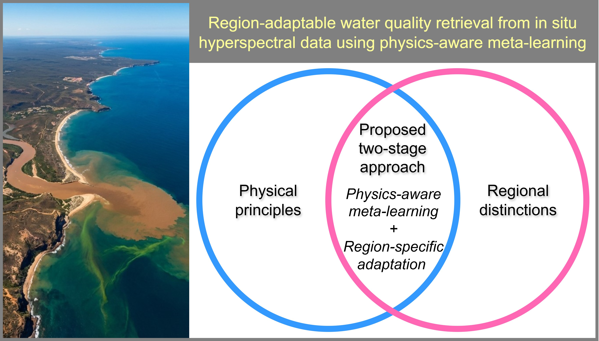

<div align="center">

# Region-adaptable water quality retrieval from in situ hyperspectral data using physics-aware meta-learning

</div>

## ✨ Introduction

Hyperspectral in situ sensing has shown promise in retrieving water biogeochemical (BGC) parameters, such as total suspended solids, dissolved organic carbon, and total chlorophyll-a, in a cost-effective manner. However, generalising such retrieval algorithms across water bodies remains challenging, as the relationship between spectral observations and BGC parameters can vary considerably from one region to another due to regional distinctions in environmental conditions and biogeochemistry that lead to different BGC ranges and bio-optical properties. In this study, we propose a two-stage physics-aware meta-learning framework for retrieving BGC parameters from in situ hyperspectral data. In the first stage, a bio-optical forward model is used to generate a large synthetic dataset based on a bio-optical library with broad representativeness of Australian coastal waters. This dataset is then used to pretrain a region-agnostic base model with meta-learning, allowing the model to learn fundamental physical relationships. In the second stage, the pretrained base model is fine-tuned for specific regions, requiring a reduced number of local samples given the regularisation provided by the pretrained base model during regional adaptation. To evaluate the proposed approach, we collected in situ hyperspectral and BGC measurements from five geographically distinct sites in Australian coastal waters, including four newly established sites and an existing monitoring site. Clear regional distinctions were observed among the sites in both the BGC parameters and their corresponding hyperspectral reflectance signatures. Evaluation results using data collected from these sites demonstrate that our method achieved higher retrieval accuracy for BGC parameters than three state-of-the-art empirical models. Results also suggest that physics-aware pretraining and region-specific adaptation improved the retrieval accuracies. The in situ measured and model-predicted BGC parameters showed good agreement in both magnitude and temporal dynamics, highlighting the potential of in situ hyperspectral sensing as a cost-effective solution for continuous time-series monitoring of water quality. These results demonstrate the effectiveness of the proposed physics-aware meta-learning approach, which integrates physical principles with regional distinctions, for region-adaptable hyperspectral retrieval of BGC parameters.



## 🎬 Video Explainer

Please Watch the video below for an explanation of this work.

<p align="center">
  <video src="https://github.com/user-attachments/assets/a4c4fd51-6f26-4a0d-aee6-08372567995d"
         controls
         width="800">
  </video>
</p>

## 📢 News

[2026-03] The preprint manuscript is now available on arXiv.

[2026-03] The demo code is released; The pretrained model is available at ./models/ ; The demo datasets are available at ./datasets/ .

## 📈 Usage

- Create conda environment with python:

```
conda create --name wqmeta python=3.12.3
conda activate wqmeta
```

- Install required packages:

```
pip install -r requirements.txt
```

- Run the demo code:

```
python demo_run.py --data_dir datasets
```

The outputs will be stored in the ./outputs/ folder.

## 📝 Citation

If you find this repo or our work useful for your research, please consider citing the paper:

```tex
@article{guo2026region,
  title={Region-adaptable water quality retrieval from in situ hyperspectral data using physics-aware meta-learning},
  author={Guo, Yiqing and Cherukuru Nagur and Lehmann, Eric and Unnithan, S. L. Kesav and Malthus Tim and
Kerrisk, Gemma and Qi, Xiubin and Islam, Faisal and Dhar Tisham},
  journal={},
  year={2026}
}
```

## 🙏 Acknowledgements

The authors would like to sincerely thank the following organisations and services for their support to this work: Commonwealth Scientific and Industrial Research Organisation (CSIRO) AquaWatch Australia Mission, CSIRO AI4Missions, South Australian Research and Development Institute (SARDI), CSIRO Data61, CSIRO Environment, CSIRO Space and Astronomy, CSIRO Earth Analytics Science and Innovation (EASI) platform, and CSIRO AquaWatch Data Service (ADS). 

The authors would like to acknowledge the in situ data from Lucinda Jetty Coastal Observatory (Principal Investigator: Dr Thomas Schroeder with CSIRO Environment). These data were sourced from Australia’s Integrated Marine Observing System (IMOS). IMOS is enabled by the National Collaborative Research Infrastructure strategy (NCRIS). It is operated by a consortium of institutions as an unincorporated joint venture, with the University of Tasmania as Lead Agent.

The authors would like to thank Mr Nathan Drayson with CSIRO Environment for providing the original version of the bio-optical modelling code. Thanks also go to Ms Florina Richard with CSIRO Environment, Dr Foivos Diakogiannis with CSIRO Data61, and Prof. Wei Xiang, Ms Tracy Luo, and Dr Kang Han with La Trobe University for helpful discussions, Dr Rob Woodcock with CSIRO Space and Astronomy for his guidance on the ADS platform, as well as all the technicians who assisted with the setup and maintenance of the experimental sites and in situ instruments.

## 📪 Contact

If you have any question, please contact [yiqing.guo@csiro.au]().
